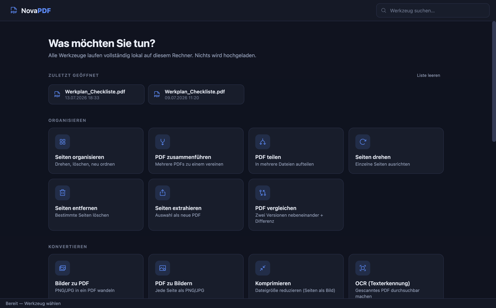
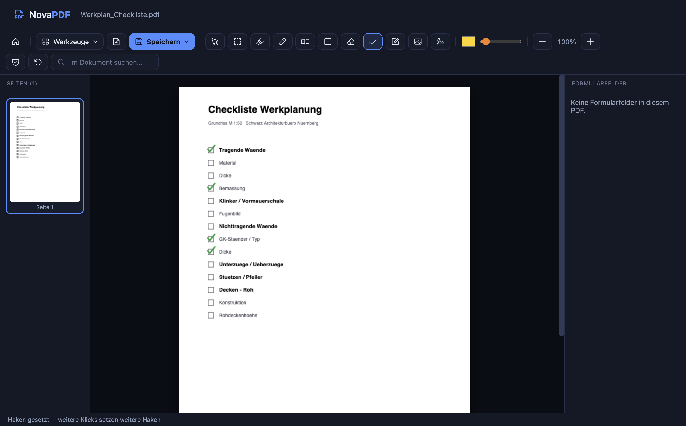

<div align="center">

# 📄 NovaPDF

### Portabler PDF-Editor — vollständig lokal, keine Cloud, offline

Bearbeiten · Organisieren · Konvertieren · Signieren · Schwärzen — alles auf Ihrem Rechner.


<br>

### ⬇️ Download

[-000000?style=for-the-badge&logo=apple&logoColor=white)](https://github.com/mozzi86/NovaPDF/releases/latest/download/NovaPDF-1.0.0-arm64.dmg)
&nbsp;
[-0078D6?style=for-the-badge&logo=windows&logoColor=white)](https://github.com/mozzi86/NovaPDF/releases/latest)
&nbsp;
[](https://github.com/mozzi86/NovaPDF/releases)

</div>

---

<div align="center">

<br><br>

</div>

---

## Was NovaPDF kann

| 🗂️ Organisieren | 🔄 Konvertieren | ✏️ Bearbeiten | 🔒 Abschließen |
|---|---|---|---|
| Seiten organisieren | Bilder → PDF | PDF bearbeiten | Forensisch schwärzen |
| Zusammenführen | PDF → Bilder (PNG/JPG) | Text bearbeiten | Fixieren (flatten) |
| Teilen | Komprimieren | Kommentieren & zeichnen | **Passwort schützen (AES)** |
| Drehen | **OCR (Deutsch/Englisch)** | Signieren | Beschränkungen entfernen |
| Entfernen · Extrahieren | | **Grüner Haken** ✓ | |
| **PDF vergleichen** (Diff) | | **Stempel & Briefkopf** | |
| **Markierungsrahmen** ▢ | | Wasserzeichen · Seitenzahlen | |

**📐 Layout-Werkzeuge:** Mehrere Seiten pro Blatt (N-up) · Broschüre (Booklet) · Seiten skalieren (A4–A0) · Leerseiten entfernen

## Highlights

- **✓ Checklisten abhaken** — Haken-Werkzeug: klicken setzt grüne Haken, ideal für Prüf- und Werkplanungslisten.
- **▢ Markierungsrahmen wie in CAD** — Bereich aufziehen, alle Elemente darin gemeinsam verschieben oder löschen.
- **🔍 OCR komplett offline** — gescannte PDFs durchsuchbar machen (Deutsch + Englisch), keine Internetverbindung nötig.
- **⚖️ PDF vergleichen** — zwei Planrevisionen nebeneinander oder als Pixel-Differenz; Abweichungen leuchten magenta.
- **🖊️ Echt schwärzen** — „Forensisch schwärzen" entfernt den Text physisch aus der Datei, nicht nur optisch.
- **🔐 Verschlüsseln** — Passwortschutz mit AES beim Speichern.
- **🏢 Stempel & Briefkopf** — Prüfstempel platzieren, Briefkopf-PDF über alle Seiten legen.

## Sicherheit & Privatsphäre

Alle Werkzeuge laufen **vollständig lokal** im Electron-Prozess. Es gibt keinen Server, keine Uploads, keine Telemetrie. Die App funktioniert offline. Verschlüsselte PDFs werden beim Öffnen bewusst abgelehnt, statt sie beim Speichern zu beschädigen.

## Installation (macOS)

1. DMG oben herunterladen und öffnen, NovaPDF in **Programme** ziehen.
2. Beim ersten Start: **Rechtsklick auf NovaPDF → Öffnen** (die App ist nicht bei Apple notarisiert).
3. PDF öffnen per **Drag & Drop ins Fenster**, über **Datei → Öffnen**, oder Rechtsklick → **Schnellaktionen → Mit NovaPDF öffnen**.

## Entwicklung

```bash
npm install     # Electron + pdf-Libs + Phosphor + tesseract.js
                # lädt beim ersten Mal die OCR-Sprachdaten (deu/eng), danach offline
npm start       # App starten
```

## Eigene Builds

```bash
npm run dist        # Windows: release/NovaPDF-1.0.0-portable.exe
npm run dist:mac    # macOS:   release/NovaPDF-1.0.0-*.dmg
```

Die portable Windows-`.exe` ist eigenständig — auf jeden Windows-Rechner oder USB-Stick kopierbar, keine Installation.

## Technik

pdf.js (Rendering) · [@cantoo/pdf-lib](https://github.com/cantoo-scribe/pdf-lib) (Dokumentstruktur + AES) · tesseract.js (OCR) · Phosphor Icons · Electron. Kein Bundler — die Browser-Builds werden per `scripts/copy-vendor.js` nach `vendor/` kopiert.

## Bewusst (noch) nicht enthalten

Office → PDF (braucht LibreOffice) · PDF → Word/Excel (braucht echte Konverter) · Passwort *entfernen* bei echter Verschlüsselung (braucht qpdf + Passwort).

---

<div align="center">
<sub>Schwarz Architekturbüro Nürnberg · Bilder mit dem eingebauten Screenshot-Skript erzeugt (<code>scripts/make-shots.js</code>)</sub>
</div>
